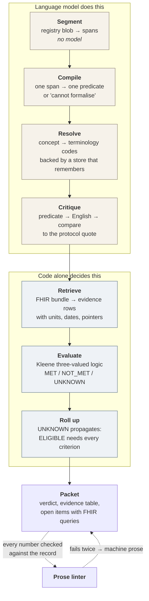

# Caliper

Pre-screening patients against clinical trial eligibility criteria, where the model compiles and
the code decides.

Caliper reads a trial's eligibility criteria as the registry publishes them, compiles each one into
an executable predicate, and evaluates those predicates against a patient's record with ordinary
Python. A language model never issues the verdict. It cannot: the module that produces a screening
decision has no import path to the module that talks to a provider, and the decision itself runs on
three-valued logic in which `ELIGIBLE` is unreachable while any criterion is unresolved.

The interesting output is therefore not the eligible patients. It is the criteria the system refuses
to decide, each one carrying the exact datum that would resolve it.

---

## Who this is for

A **clinical research coordinator** at a trial site. Their job includes deciding which patients on
their list are worth bringing in for a screening visit, and they do it by reading a protocol's
inclusion and exclusion criteria — routinely twenty to sixty of them — against a patient's chart,
one criterion at a time.

**The bottleneck is that this is thirty to sixty minutes per patient per trial, and most of it is
wasted.** Most patients fail on one criterion, but you cannot know which one without checking
several. Enrolment is the single largest cause of clinical trial delay, and sites carry the cost of
it in coordinator hours.

**Why the obvious fix does not work.** Asking a capable model "is this patient eligible?" produces a
fluent answer in seconds. The answer is confident whether or not the chart contains the information
needed to support it, and a coordinator has no way to tell those two cases apart. That failure is
expensive in both directions: a patient called eligible who is not wastes a screening visit and the
patient's time, while a patient called ineligible who is not is an enrolment nobody ever finds out
was missed.

Caliper is built around making that distinction structural rather than a matter of the model's
mood.

---

## How it works



Four design choices carry the system, and each is measured separately in
[`CHANGELOG.md`](CHANGELOG.md).

**Compilation happens one span at a time.** The registry stores eligibility criteria as a single
free-text field formatted by whoever registered the trial — asterisk bullets or numbered lists,
headers with or without colons, escaped Markdown, and a boilerplate sentence that looks like a
criterion and is not. Caliper segments that deterministically first, then compiles each span on its
own. This bounds what the model is asked to do, contains a failure to one criterion, and — the part
that matters — makes coverage a property of the loop. A span whose compilation failed is reported as
a hole in the protocol rather than quietly missing, which is the compiler failure most likely to go
unnoticed and most likely to matter.

**A quote that is not verbatim is not trusted.** Every compiled criterion carries the protocol text
it came from, and that text is checked against the source. A compiler that paraphrased before
formalising has already stopped reading the document it claims to implement, and there is no way to
tell afterwards which version the predicate encodes, so the criterion is downgraded to unresolved.

**The critic never sees the JSON.** It is handed two English sentences — the protocol's own words,
and a deterministic rendering of what the predicate actually says — and asked whether they mean the
same thing. Comparing two sentences is a job a model can do reliably and a human can audit;
inspecting a data structure for subtle wrongness is not. Anything other than *equivalent* is a
downgrade, including *narrower*: a criterion that admits fewer patients than the protocol wrote down
is still screening the wrong people.

**Absence is a named decision, not an assumption.** A chart that never mentions myocardial
infarction may mean the patient never had one, or may mean nobody wrote it down. The default policy
accepts absence only where an encounter documents the relevant window; the open-world and
closed-world alternatives are implemented, measured, and reported side by side, because the size of
that assumption belongs in the results rather than in a footnote.

### Abstention that does something

Every unresolved criterion carries a **resolution hint**: the missing datum, where a coordinator
would find it, the FHIR query that would close it, and which criterion it blocks.

This is not decoration. A 2025 study of 259 clinicians found that a system abstaining without
explanation did not remove errors so much as move them — missed diagnoses rose 18% and missed
treatments 35% on the cases where the AI declined. Silence is not safety. A packet that says "I
cannot tell" and stops has handed the coordinator back the whole job; one that says "I cannot tell,
because there is no creatinine result after 2025-11-14, and here is the query" has handed back a
task.

---

## Results

Full numbers, the risk-coverage curve, every ablation and every trivial baseline are in
[`RESULTS.md`](RESULTS.md), generated by `caliper report` from the committed run.

The primary measure is **coverage at zero unsafe errors** — the share of patient-and-trial pairs
decided without a human, subject to committing no unsafe error at all. An *unsafe* error means a
patient was sent forward as eligible when the answer key says they were not, or says a human had to
look first. This is one operating point on a risk-coverage curve in the sense of El-Yaniv and Wiener
(2010), and the whole curve is reported, because any system reaches zero unsafe errors by abstaining
on everything. The **false-abstention rate** and an explicit always-abstain baseline are in the same
table so that trade is visible rather than implied.

The answer key was frozen and hashed before the first scored run; its digest is in
[`eval/answer_key.json.sha256`](eval/) and `caliper eval` refuses to score against a key that no longer
matches it.

---

## Reproduce it

The headline result replays recorded model responses. **No API key, no network, no cost.**

```bash
docker build -t caliper .
docker run --rm caliper
```

Or locally:

```bash
make install
make data-verify     # every fixture matches its committed digest
make eval            # the headline result, from recorded responses
```

Full instructions, including the live path and what it costs, are in
[`REPRODUCE.md`](REPRODUCE.md). A guided five-minute path for reviewers is in
[`JUDGES.md`](JUDGES.md).

---

## What is real and what is not

Trial criteria are real, pulled from ClinicalTrials.gov and committed unmodified. Patients are
synthetic Synthea records with no PHI. Clinical notes are hand-authored for this project, because
Synthea's own notes are templates. The screening logic is deterministic. The answer key is ours.

[`LIMITS.md`](LIMITS.md) says all of that precisely, along with what Caliper genuinely cannot do,
where the synthetic data is unrealistic, and which of our own results we would attack first.
[`EVIDENCE.md`](EVIDENCE.md) tags every claim in this README by what backs it.

**Caliper is decision support for pre-screening. It is not a medical device, it has not been
clinically validated, and eligibility is determined by the investigator.**

---

## Prior art

Caliper is not the first system to match patients to trials, and per-criterion abstention is not
novel. Saying so is cheaper than being told.

- **TrialGPT** (Jin et al., *Nature Communications* 2024) already labels criteria
  `Included / Not included / Not enough information / Not applicable`, and reports 87.3% criterion-level
  accuracy with a 42.6% reduction in screening time.
- **RECTIFIER** (Unlu et al., *NEJM AI* 2024) went further than any of this and ran a randomised
  trial, roughly doubling enrolment rate against manual screening.
- **TREC Clinical Trials** has used a three-way judgment separating "excluded" from "insufficient
  information" since 2021, and **n2c2 2018 Track 1** established the dual-expert annotation standard
  for cohort selection.
- **Criteria2Query** and the **OHDSI ATLAS** cohort expression compile criteria into executable
  queries, and `circe-be` has been turning a JSON intermediate representation into SQL for years.
- **CQL** already specifies three-valued logic with null propagation, and Caliper's evaluator
  implements the same semantics deliberately rather than by coincidence.

What is ours is the combination: propagation that makes `ELIGIBLE` structurally unreachable, an
evaluator with no path to a model, per-criterion evidence pointers a coordinator can open, and
abstention accounted for as a measured quantity rather than a behaviour.

---

## The main failure mode

**The trust moved; it did not disappear.** Caliper's evaluator cannot hallucinate, but it evaluates
what the compiler gave it, and the compiler is a language model. Every guard we added — verbatim
quote checking, deterministic back-translation, the confidence gate on terminology codes — narrows
that surface without closing it. A criterion compiled with a plausible wrong threshold, resolved to
a plausible wrong code, and back-translated into a sentence that reads correctly will produce a
confident, evidence-cited, wrong verdict, and it will look exactly like a right one.

The honest mitigation is not another model checking the first. It is that the compiled criteria are
a small, readable, reviewable artifact — a few dozen lines of JSON per trial that a coordinator can
read once and approve, after which every patient screened against that trial inherits the review.
Caliper is built so the human review happens where it is cheap, once per protocol, rather than where
it is expensive, once per patient.

## Hot take

**Put the frontier model where it can be checked, and the checking will matter more than the
model.** We ran the same evaluation with the full harness on a mid-tier open-weight model and with a
frontier model answering the question directly, and the numbers are in [`RESULTS.md`](RESULTS.md).
The general lesson we would carry into the next build: a system's reliability is set by how much of
its output is verifiable by something other than another model, and every design decision that
converts a judgement into a check buys more than upgrading the model does. The corollary is
uncomfortable — most of what makes Caliper work is not the agentic part. It is the part that
prevents the agent from being consulted.

---

## Engineering process

This project was built with coding agents, which the challenge requires disclosing.

The tools used, how work was divided between them, the instructions each agent was given, and
representative trajectories for every agent — both the agents *inside* Caliper and the coding agents
used to *build* it — are in [`AGENTS.md`](AGENTS.md) and [`trajectories/`](trajectories/).

---

## Layout

| Path | What is in it |
|---|---|
| `src/caliper/logic.py`, `evaluate.py`, `screen.py` | The deterministic core. No model is reachable from here. |
| `src/caliper/ir.py`, `wire.py` | The compiled criteria representation, and the depth-bounded schema sent to a model. |
| `src/caliper/agents/` | Compiler, resolver, critic, writer, extractor, with their instructions in `prompts/`. |
| `src/caliper/prose.py` | The linter that checks model-written sentences against the record. |
| `src/caliper/metrics.py` | Risk-coverage, selective risk, exact confidence intervals. |
| `data/` | Ten real trials, twenty-four synthetic patients, hand-authored notes, all with digests. |
| `eval/` | The frozen answer key, the annotation artifacts, the run outputs. |

## Licence

MIT, see [`LICENSE`](LICENSE). Trial data from ClinicalTrials.gov and patient data from MITRE's
Synthea are used under their own terms; see [`data/DATA_SOURCE.md`](data/DATA_SOURCE.md).
